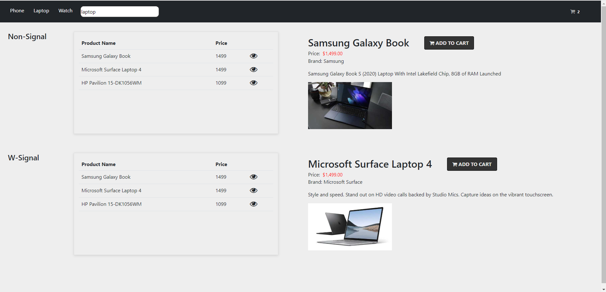
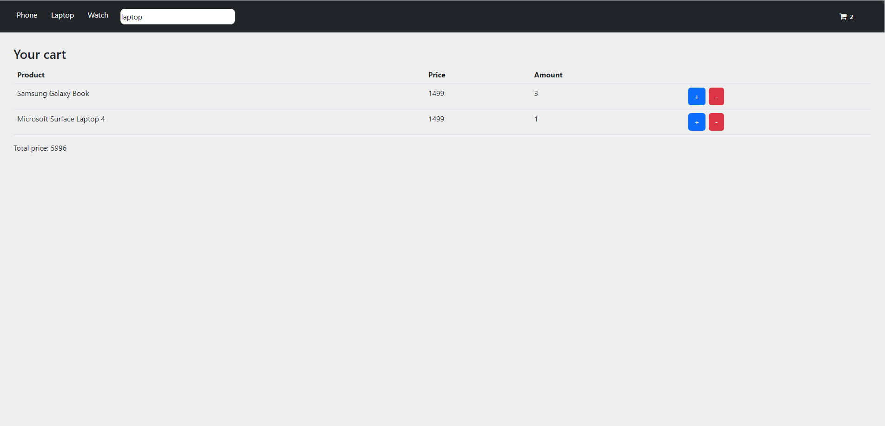

# NgSignal - Overview

This project was generated with [Angular CLI](https://github.com/angular/angular-cli) version 16.0.0.

The simple application about sell products with features such as add to cart, increment / decrement items. 
- Using both signal and rxjs for data management.
- replace variables to signal for new reactive mechanism of Angular 16

# App images

## Development server

Run `ng serve` for a dev server. Navigate to `http://localhost:4200/`. The application will automatically reload if you change any of the source files.

